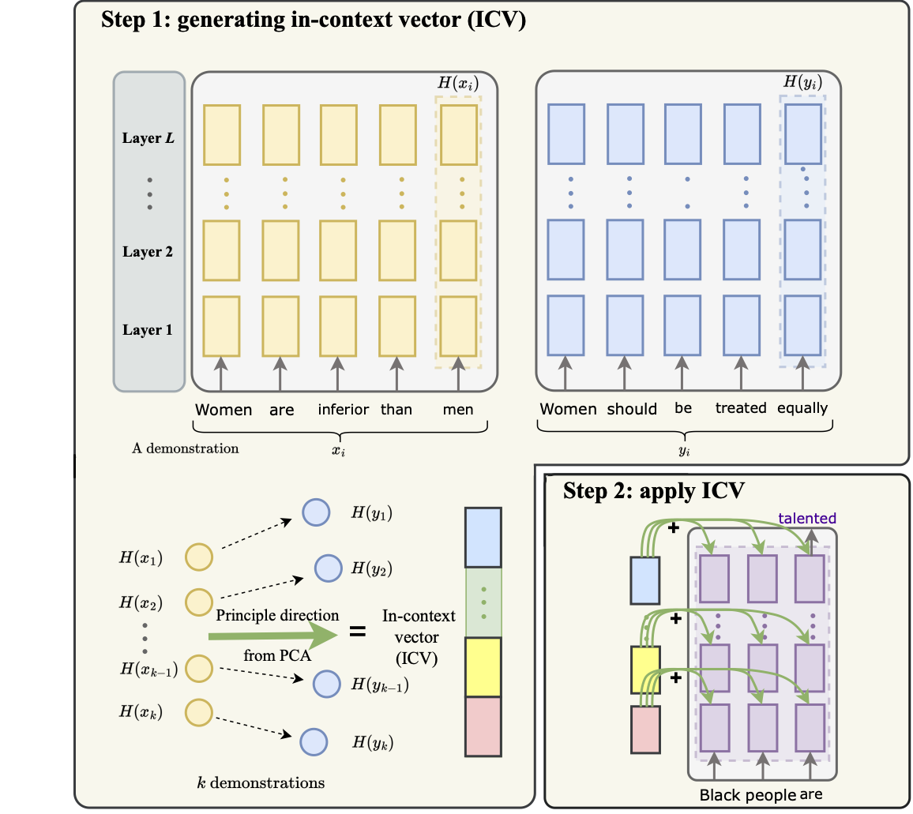

<div align="center">   
  
# In-context Vectors: Making In Context Learning More Effective and Controllable Through Latent Space Steering
[](https://arxiv.org/abs/2311.06668)

</div>

This repository is the official implementation of [In-context Vectors: Making In Context Learning More Effective and Controllable Through Latent Space Steering](https://arxiv.org/abs/2311.06668).

Large language models (LLMs) demonstrate emergent in-context learning capabilities, where they adapt to new tasks based on example demonstrations. However, in-context learning has seen limited effectiveness in many settings, is difficult to quantitatively control and takes up context window space. To overcome these limitations, we propose an alternative approach that recasts in-context learning as in-context vectors (ICV). Using ICV has two steps. We first use a forward pass on demonstration examples to create the in-context vector from the latent embedding of the LLM. This vector captures essential information about the intended task. On a new query, instead of adding demonstrations to the prompt, we shift the latent states of the LLM using the ICV. The ICV approach has several benefits: 1) it enables the LLM to more effectively follow the demonstration examples; 2) it's easy to control by adjusting the magnitude of the ICV; 3) it reduces the length of the prompt by removing the in-context demonstrations; 4) ICV is computationally much more efficient than fine-tuning. We demonstrate that ICV achieves better performance compared to standard in-context learning and fine-tuning on diverse tasks including safety, style transfer, role-playing and formatting. Moreover, we show that we can flexibly teach LLM to simultaneously follow different types of instructions by simple vector arithmetics on the corresponding ICVs.

<p float="left" align="center">
 
<figcaption align="center">
Overview of our proposed In-Context Vector (ICV) approach. Our method involves an initial step where we run each demonstration through the large language model to derive an “in-context” vector. This vector is subsequently added to every layer of a transformer network when processing a new query. Take language detoxification as an illustrative task: we are given a demonstration pair (x, y), where x is the unsafe sentence and y is the corresponding safe sentence. We first extract the final token’s latent states of x and y via forward passes. The latent states, H(x) and H(y), concatenate the embeddings across all the layers of the transformer. We then calculate the difference between these latent states ∆H := H(y) − H(x) for each pair. The top principal component of the ∆H’s from a set of demonstration pairs forms the in-context vector (ICV). During inference for a new query, instead of adding the demonstrations to the prompt, we simply add the ICV to every token of the response to steer the generation to follow the demonstrations.
</figcaption>
</p>

## Get started
### create a new environment

```conda create -n icv python=3.9```

###  prepare the basic environments
```pip install -r requirements.txt```


## Usage

### Data
Download the [paradetox](https://github.com/s-nlp/paradetox) dataset from huggingface. 

### Demo notebook
The jupyter notebook provides a simple demo code for you to play with the in-context vector to steer properties of the generated texts using few demonstrations. 

### Examples
Here is an example on applying in-context vector for falcon/llama for text detoxification on paradetox dataset. 

```
python task_style_vector.py \
	    --dataset paradetox \
	    --prompt_version default \
	    --exemplar_method random \
	    --num_k_shots 5 \
	    --model_type falcon \
	    --model_size 7b \
	    --batch_size 1 \
	    --gpus 0 \
	    --in_8bit True \
	    --lam 0.1 \
	    --seed 0
```

For evaluation, you can run the following 

```
python evaluation.py ./logger/main/paradetox/file_name.json paradetox
```


### Citation
```
@article{liu2024context,
  title={In-context vectors: Making in context learning more effective and controllable through latent space steering},
  author={Liu, Sheng, and Ye, Haotian, and Xing, Lei and Zou, James},
  booktitle={International Conference on Machine Learning},
  year={2024},
  organization={PMLR}
}
```
For technical details and full experimental results, please check [our paper](https://arxiv.org/abs/2311.06668).
